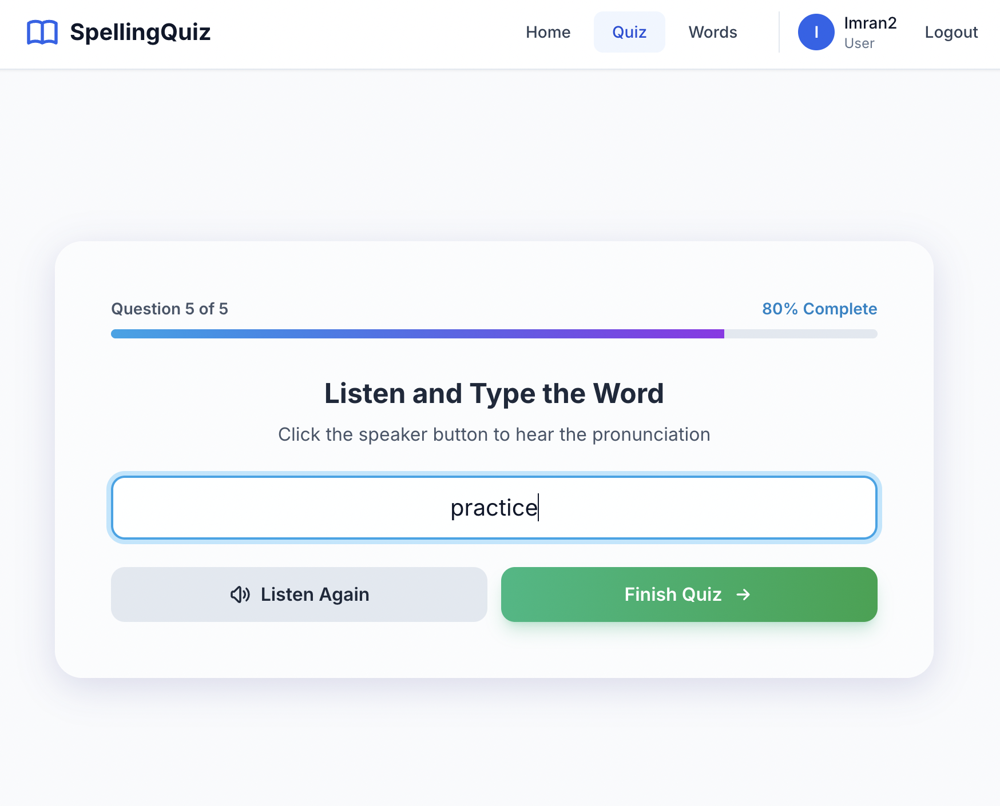
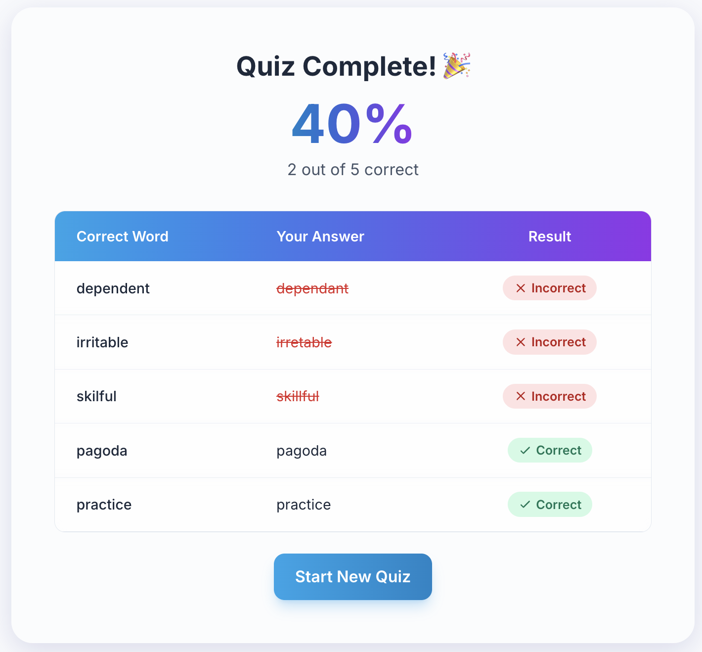
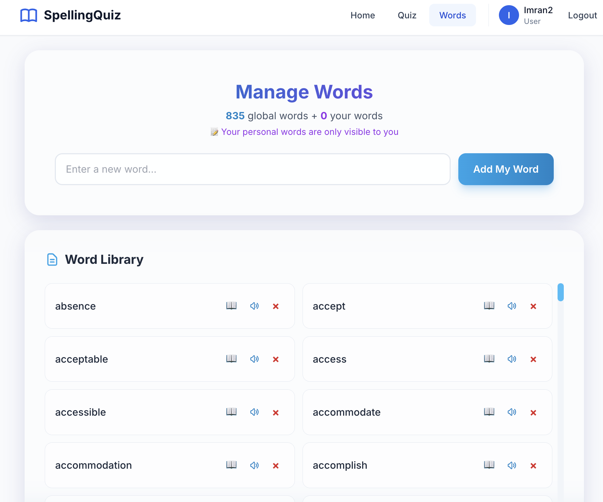

# 📝 Spelling Quiz

A React-based spelling quiz application with Firebase backend and 835+ commonly misspelled words.






## Features

- 🎯 Interactive spelling quizzes with multiple difficulty levels
- 🔊 Audio pronunciation using Web Speech API
- 🔐 User authentication (Email, Google, or Anonymous)
- 📚 Word library with 835+ words
- 🎨 Modern UI with dark mode support
- � Tiered access: Admin, Registered Users, and Guests

## Setup

1. **Install dependencies**
   ```bash
   npm install
   ```

2. **Configure Firebase**
   
   Create `.env` file with your Firebase credentials:
   ```env
   REACT_APP_FIREBASE_API_KEY=your_api_key
   REACT_APP_FIREBASE_AUTH_DOMAIN=your_domain
   REACT_APP_FIREBASE_PROJECT_ID=your_project_id
   REACT_APP_FIREBASE_STORAGE_BUCKET=your_bucket
   REACT_APP_FIREBASE_MESSAGING_SENDER_ID=your_sender_id
   REACT_APP_FIREBASE_APP_ID=your_app_id

   REACT_APP_VOICERSS_DOT_ORG_API_KEY=your-api-key-here
   ```

3. **Start the app**
   ```bash
   npm start
   ```
   Open [http://localhost:3000](http://localhost:3000)

4. **Import words** (Admin only)
   - Login as admin (`polboy777@gmail.com`)
   - Go to `/admin`
   - Click "Import 835 Words"

## User Roles

| Role           | Can Add Words             | Word Visibility | Can Delete |
| -------------- | ------------------------- | --------------- | ---------- |
| **Admin**      | Global words (all users)  | All             | Any word   |
| **Registered** | Personal words (own only) | Global + Own    | Own only   |
| **Guest**      | No (prompted to sign up)  | Global only     | None       |

## Tech Stack

- React 18
- Firebase (Firestore, Auth)
- Tailwind CSS
- React Router v6
- Web Speech API

## Build

```bash
npm run build
```

## License

MIT
